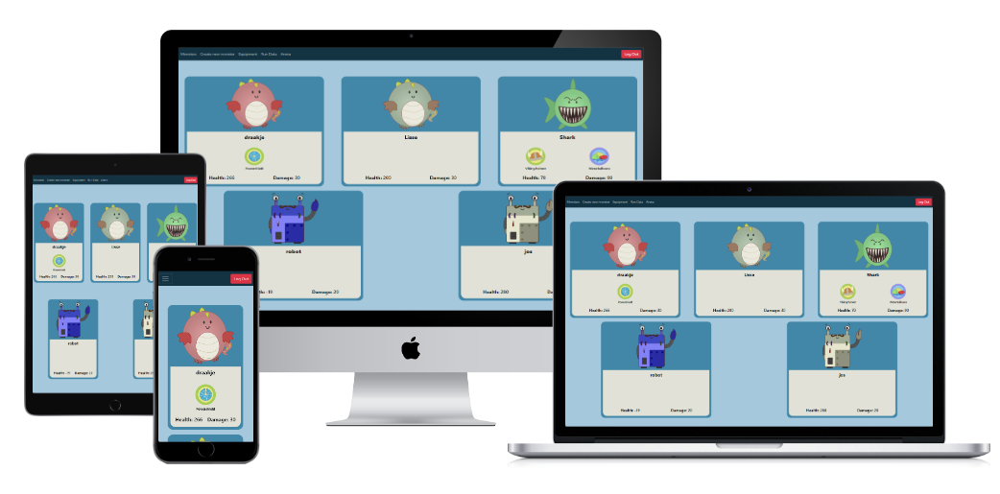
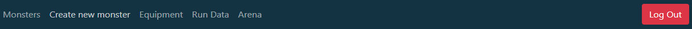
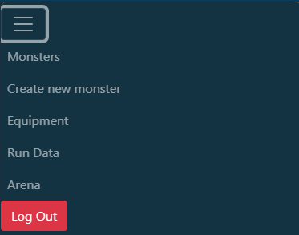
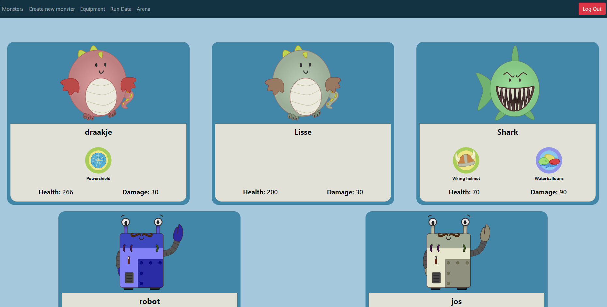
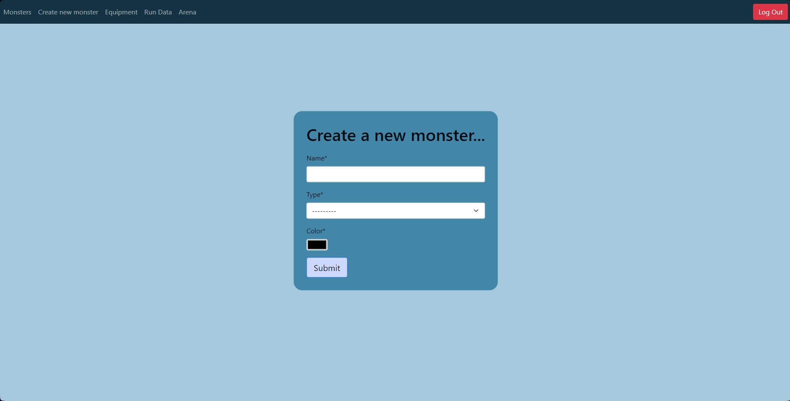
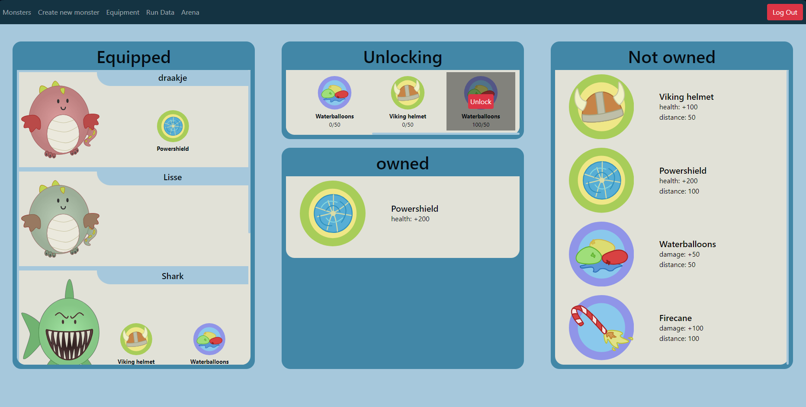
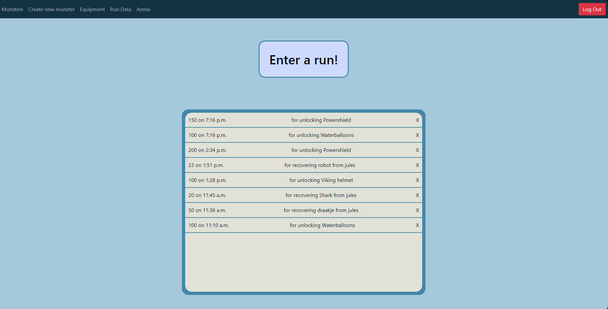
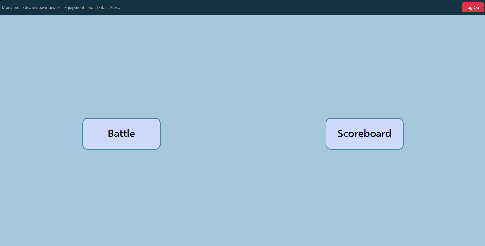
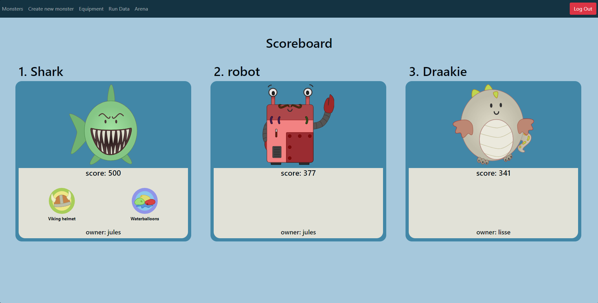
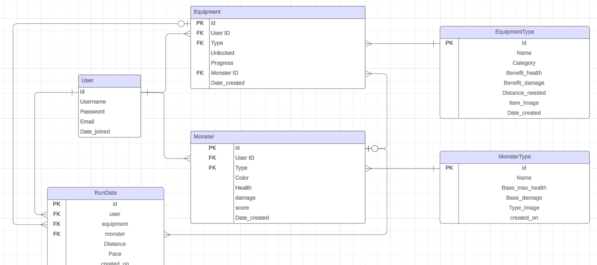

# Monster Run

[Live website on Heroku](https://monster-run-deaac2a71438.herokuapp.com)



## Strategy
Monster Run is designed to motivate individuals to start or maintain their running routines. Players can create and battle monsters, earning points by entering their running data to unlock new equipment or recover health points lost during battles. The game features a leaderboard to compare monsters and track points.

The project aims to demonstrate proficiency in the Django framework by showcasing an understanding of database models and delivering a fully functional web application that highlights both front-end and back-end capabilities.


### Leading User Stories
#### As a user...

- I can Sign up so that I can use the site
- I can Create a monster so that I can start to develop my monster stats
- I can Create a new monster so that I have multiple monsters
- I can Choose an item so that I can start unlocking that item
- I can Enter running data so that I make progress and unlock items
- I can unlock equipment if i have met the required goal so that I can equip it to my monster if I want
- I can Choose more than one equipment so that I can make progress on multiple equipments
- I can Equip an item to my monster so that My monster gains the items benefits
- I can delete a run so that the progress it made for unlocking or recovery is undone
- I can Go to the arena so that I can battle my monster
- I can go to the scoreboard so that I can see the monster with the highest score
- I can view the site on different types of devices so that everything looks good

#### As an admin...

- I want to add monster types so users have more options for creation.
- I want to add equipment types for users to unlock and equip.

### Primary strategic aims for the application
- Provide an engaging platform for users to track their running and develop monsters.
- Ensure a responsive design that adapts seamlessly to different devices.
- Encourage competition through leaderboards and battles to foster user engagement.

## Scope
An agile approach will be adopted, keeping features simple and aligned with the user stories.

### In Scope Features
- User registration and login.
- Monster creation interface.
- Equipment management system.
- Run data entry and management.
- Arena for monster battles.
- Leaderboard to display top monsters.

### Out of Scope Features (for future releases)
- Integration with the Strava API for automatic running data collection.
- Development of a PvP arena for player-versus-player battles.

## Structure
The website is designed with a user-centric approach, ensuring that all features align with the identified user stories. The following elements illustrate the structure of the application:

### Navigation Bar:
- Located at the top of the page, the navbar allows users to access key sections of the application easily.
- Features a logout button for quick session termination, promoting user security.

### User Registration and Login:
- A simple and intuitive sign-up form allows users to create accounts, facilitating access to the game’s features.
- Once logged in, users are directed to their personalized dashboard.

### Monster Creation Interface:
- Users can create their first monster upon logging in or navigate to the "Create Monster" page if they have no existing monsters.
- The form for monster creation is straightforward, prompting users to input basic stats and select a type, allowing for the development of unique monsters.

### Multiple Monster Management:
- Once users have created a monster, they can easily access their "Monsters Page," displaying all owned monsters and their stats.
- Users can create additional monsters from this page, promoting diversity in gameplay.

### Equipment Management System:
- On the "Equipment Page," users can view available items, track their unlocking progress, and choose items to unlock.
- The ability to equip or unequip items to specific monsters is clearly presented, enhancing customization and strategy.

### Run Data Entry and Management:
- Users can navigate to the "Run Data Page" to enter their running data, essential for unlocking new equipment and recovering health points.
- Each run entry includes a form where users specify whether the data is for equipment unlocking or monster recovery.
- Users can also delete run entries if incorrect information was entered, automatically reverting any associated progress.

### Arena for Monster Battles:
- Users can go to the "Arena Page" to battle their monsters against randomly generated enemy monsters.
- The page provides a clear interface for selecting a monster and initiating battles, ensuring users know how to proceed.

### Leaderboard Display:
- The "Leaderboard Page" showcases the top monsters based on points, allowing users to compare their progress against others.
- This competitive aspect encourages engagement and motivates users to continue playing.

### Responsive Design:
- The site is fully responsive, ensuring that all elements are accessible and visually appealing on various devices, including smartphones and tablets.
- The layout adapts seamlessly, maintaining usability across different screen sizes.

By focusing on these structural elements, the application not only fulfills the user stories but also creates an enjoyable and engaging experience for players, fostering a community centered around fitness and gaming.

## Skeleton
The application prioritizes ease of use, featuring a clean interface that guides users through the process of creating monsters, entering run data, and battling in the arena.

Users can navigate quickly, and the aesthetic maintains a fun yet straightforward theme, enhancing the overall gaming experience.

## Surface
I am aiming for a clean, readable interface that enhances user experience.

### Colour
The chosen color palette for the Monster Run game combines calming blues and soft neutrals to create an inviting and immersive atmosphere.
Overall, the palette harmonizes well to create an engaging environment that balances adventure, friendliness, and a hint of whimsy, enhancing the player’s experience in the Monster Run game.


### Font
A legible font has been selected to ensure clarity across the interface, contributing to an enjoyable user experience.

## Features

### Existing features

- #### __Navbar__

- At the top of the page we find a nav section that lets players navigate the application and has a log out button.



- The navbar is responsive and changes into a burger icon on smaller screens.




- #### __Monster page__

- This page is the homepage for users that are logged in.
- This page displays all the users monsters with their stats and equipped equipments.



- #### __Create monster page__

- Users without any monsters are directed to this page when trying to enter the home page.
- Users are presented with a simple form where they can create their own monsters.



- #### __Equipment page__

- On this page users can manage their equipments.
- Users are able to start unlocking new equipments by clicking on one of the available equipments.
- Users can track the progress on the equipments they are unlocking.
- Once enough progress is made users can unlock the equipment.
- Users can choose to equip/unequip their unlocked equipments to their monsters.



- #### __Run data page__

- On this page users can see their previously entered runs.
- Users can delete runs if they entered wrong information.
- Users can also enter new runs.
- When entering a new run, users will have to choose if they want to enter the run to recover a damaged monster or to unlock equipment.
- When a run is deleted its effect is also deleted (equipments can become locked again).



- #### __Arena page__



- ##### __Leaderboard__
- On this page users can see a leaderboard of the monsters with the most points.



- ##### __Battleground__
- When a user enters the battleground they have to choose one of their monsters to use in the fight.
- An enemy monster is randomly generated and has 0, 1 or 2 randomly assigned equipments.
- the user and enemy take turns atacking, each time it is the users turn, when they click the box in the center it starts rapidly generating random numbers between 0 and their monsters damage points. When they stop by clicking again, that number is the damage of their attack. The enemy (computer) does the same thing on their turn.
- Once one of the monsters reaches 0 or less health the battle is over. if the user won, they gain points equal to the health points they have left.


### Features left to implement on future releases

- Connecting to the strava api to automaticly collect running data.

- Create a PvP arena where players can battle each other.

## User Stories

- ### As a user:
- I can Sign up so that I can use the site
- I can Create a monster so that I can start to develop my monster stats
- I can Create a new monster so that I have multiple monsters
- I can Choose an item so that I can start unlocking that item
- I can Enter running data so that I make progress and unlock items
- I can unlock equipment if i have met the required goal so that I can equip it to my monster if I want
- I can Choose more than one equipment so that I can make progress on multiple equipments
- I can Equip an item to my monster so that My monster gains the items benefits
- I can delete a run so that the progress it made for unlocking or recovery is undone
- I can Go to the arena so that I can battle my monster
- I can go to the scoreboard so that I can see the monster with the highest score
- I can view the site on different types of devices so that everything looks good

- ### As a site owner/admin:
- I can add monster types from the admin panel so that users can use it when creating their monster
- I can Add equipment types so that Users can select equipment to unlock

## Database structure

In order to help navigating the database I created this database model. It shows the different tables in the database and their relation to eachother.



## Testing

### Tests

- __All the tests can be found in [this file](manual-testing.md).__

### Validators

I used the W3 validator for both HTML and CSS and JSHint for the javascript.

#### HTML:
##### Monster page:
the validator found two issues:
- I used a custom attribute 'equipment_id'.
- since the images are svg's when having multiple of the same type the ID's in the svg occur multiple times.

##### Create monster page:
the validator found one issue:
- maxlength attribute is not allowed on input type color, this was created by django form.

##### Equipment page:
the validator found Three issues:
- I used a custom attribute 'equipment_id'.
- since the images are svg's when having multiple of the same type the ID's in the svg occur multiple times.
- tr, th, td tags made by django forms

##### Run data page:
the validator found one issue:
- because there are two forms (max one is shown at any time) the id for the distance input occurs twice in the html (django forms gives this id).

##### Arena page:
the validator found no issues.

##### Scoreboard page:
the validator found two issues:
- I used a custom attribute 'equipment_id'.
- since the images are svg's when having multiple of the same type the ID's in the svg occur multiple times.

##### Battleground page:
the validator found two issues:
- I used a custom attributes.
- Since the images are svg's when having multiple of the same type the ID's in the svg occur multiple times.


#### CSS:
The validator found no issues.

#### JS:
The validator found no issues.


### Performance

- To check the performance of the page we used PageSpeed which tests for both mobile and desktop. We got an acceptable score both on mobile and on desktop.


### Compatibility

- I tested the site on several different browsers (Chrome, Firefox, Opera and Safari) and did not notice any problems on Different browsers.

### Responsiveness

- I tested the site on a number of different screen sizes ranging from very small screens e.g. iPhone 5 (320px wide) to very large screens e.g. 5K iMac Pro (5120 x 2880 px).

## Deployment

### How the page is deployed

1. **Log In to Heroku**
   - Go to the [Heroku dashboard](https://dashboard.heroku.com/apps) and log in to view your installed apps.

2. **Create a New App**
   - Click on **New** and select **Create new app**.
   - Choose a unique name for your application and select your region.
   - Click on **Create app**.

3. **Set Up Database**
   - After creating your app, navigate to your [database host](https://dbs.ci-dbs.net) (in this case the code institute PostgreSQL).
   - Set up your database and make sure to get the **Database URL**.

4. **Configure Environment Variables**
   - Go to the **Settings** tab and click on **Reveal Config Vars**.
   - Add `DATABASE_URL` to Config Vars with your database url as its value.

5. **Create Environment File**
   - In your local environment, create a new file named `env.py` in the top-level directory.
   - Add `env.py` to your gitignore file.
   - In `env.py`, set your environment variables:
     ```python
     import os
     os.environ["DATABASE_URL"] = "Paste in DATABASE_URL Link"
     os.environ["SECRET_KEY"] = "Make up your own randomSecretKey"
     ```

6. **Add Secret Key to Heroku**
   - In Heroku, go to the **Settings** tab and click on **Reveal Config Vars**.
   - Add `SECRET_KEY` to Config Vars with the value you previously generated.

7. **Update `settings.py`**
   - Remove the insecure secret key and replace it with:
     ```python
     SECRET_KEY = os.environ.get('SECRET_KEY')
     ```
   - Update your database settings to use the `DATABASE_URL`:
     ```python
     import dj_database_url
     DATABASES = {
         'default': dj_database_url.parse(os.environ.get("DATABASE_URL"))
     }
     ```
   - Add `https://*.herokuapp.com` to CSRF_TRUSTED_ORIGINS and ALLOWED_HOSTS

8. **Run Migrations**
   - Save all changes and run migrations using:
     ```bash
     python manage.py migrate
     ```

9. **Set Up Static Files with WhiteNoise**
   - To serve your static files without relying on external services, use the Python package **WhiteNoise**.
   - **Install and set up the package**:
     ```bash
     pip3 install whitenoise~=5.3.0
     pip3 install whitenoise
     ```
   - **Add the package to your `requirements.txt` file**:
     ```bash
     pip3 freeze --local > requirements.txt
     pip3 freeze whitenoise
     ```
   - **Wire up WhiteNoise to Django's `MIDDLEWARE` in `settings.py`**:
     - Note: The WhiteNoise middleware must be placed directly after the Django SecurityMiddleware.
     ```python
     MIDDLEWARE = [
         'django.middleware.security.SecurityMiddleware',
         'whitenoise.middleware.WhiteNoiseMiddleware',
         # other middleware...
     ]
     ```

10. **Create a Procfile**
    - In the top-level directory, create a file named `Procfile`.
    - Add the following line with your project name:
      ```plaintext
      web: gunicorn [PROJECT_NAME].wsgi
      ```

11. **Push Changes to Heroku**
    - In the terminal, run the following commands to add, commit, and push your changes:
      ```bash
      git add .
      git commit -m "Deploying to Heroku"
      git push heroku main
      ```

12. **Deploy Your App**
    - In Heroku, navigate to the **Deploy** tab and click on **Deploy Branch**.
    - Once the build process is complete, click on **Open App** to visit your live site.

### How to Clone the Repository

Follow these steps to clone the repository from GitHub:

1. **Access the Repository**
   - Go to the repository page on GitHub.

2. **Copy the Repository Link**
   - Click the **"Code"** button located on the right side of the screen.
   - Select **HTTPS** and copy the provided link.

3. **Open GitBash**
   - Launch a GitBash terminal on your computer.

4. **Navigate to Your Desired Directory**
   - Use the terminal to navigate to the directory where you want to place the cloned repository.

5. **Clone the Repository**
   - In the command line, type:
     ```bash
     git clone <paste the copied URL here>
     ```
   - Press the **Enter** key to begin the cloning process.

Your repository will now be cloned to your local machine.

## Credits

### Technologies Used

#### Languages Used
- HTML5
- CSS3
- JavaScript
- Python

#### Frameworks and Libraries Used
- [Bootstrap](https://getbootstrap.com/): Bootstrap CSS Framework used for styling and building responsive web pages.
- [Django](https://www.djangoproject.com/): The main Python framework used in development.
- [Django Allauth](https://django-allauth.readthedocs.io/en/latest/index.html): Used for authentication and account registration.
- [Django Crispy Forms](https://django-crispy-forms.readthedocs.io/en/latest/): Used to simplify the rendering of Django forms.
- [dj_database_url](https://pypi.org/project/dj-database-url/): Used to allow database URLs to connect to the Postgres database.
- [Gunicorn](https://gunicorn.org/): Green Unicorn, used as the web server to run Django on Heroku.
- [Whitenoise](https://whitenoise.readthedocs.io/en/latest): Provides file serving for Python applications on Heroku.

#### Software and Web Applications Used
- [Chrome DevTools](https://developer.chrome.com/docs/devtools/): Used to test responsiveness on different screen sizes, debugging, and generating Lighthouse reports to analyze page load.
- [Git](https://git-scm.com/): Utilized for version control, using the Gitbash terminal to commit changes and push to GitHub.
- [GitHub](https://github.com/): Used to store the project code after pushing from Git and to create the Kanban board for project management.
- [Heroku](https://www.heroku.com/): Used for deployment and hosting of the application.
- [HTML Validator](https://validator.w3.org/): Checks HTML code for validation.
- [JSHint](https://jshint.com/): Checks JavaScript code for validation.
- [Lucidchart](https://www.lucidchart.com/pages/): Used to create the database map.
- [W3 CSS Validator](https://jigsaw.w3.org/css-validator/): Checks CSS code for validation.
- [Inkscape](https://inkscape.en.softonic.com): Open-source vector drawing software.

### Help and Documentation
- **Brian**: My mentor for this project.
- [Django documentation](https://docs.djangoproject.com/en/5.1/): Provided extensive help and documentation on specific Django cases.
- [W3 Schools](https://www.w3schools.com): Offered documentation on basic concepts, which was very helpful.
- [Stack Overflow](https://stackoverflow.com): A valuable resource for troubleshooting problems and finding similar issues faced by others.
- [MDN Web Docs](https://developer.mozilla.org/en-US/): Provided well-written documentation to understand core concepts.
- [ChatGPT](https://chat.openai.com): Assisted in drafting the README file and writing comments for views, with all content reviewed and edited as needed.
- [Google Fonts](https://fonts.google.com): Fonts used in the site are sourced from Google Fonts.

### Media
- The favicon was created by me using Inkscape.
- All SVGs used were created in Inkscape by my girlfriend, Lisse.

